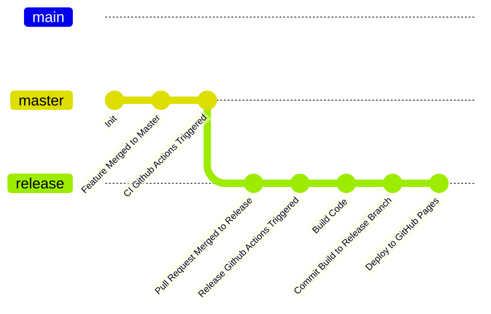

## 프로젝트 개요

- 이름: frontend-challenges
- 목적: 프론트엔드 챌린지를 통해 여러 기술을 학습하고 익숙해지는 것
- 목표: 여러 프로젝트를 하나의 서비스에서 관리할 수 있도록 구성
- 사용자: 본인
- 핵심 기능 및 주요 특징
  - 모노레포 환경에서 여러 프로젝트를 생성하고 하나의 서비스에 반영할 수 있도록 구성
  - Bootstrap을 사용해 기본적인 설정을 자동화
  - TBD를 참고로 한 브랜치 전략을 사용

## 기술 스택

- 프레임워크: Turborepo, Vite
- 패키지 매니저: PNPM
- 보조 도구: Prettier, bootstrap(workspace)

## 프로젝트 구조

```bash
/.github # github 설정
    /workflows # github actions 파일
/apps      # 챌린지 프로젝트 구성
/packages    # 공유 리소스 구성
```

## 개발 환경

- Node 버전: v20.18.0
- PNPM 버전: v9.12.3
- 프로젝트 생성 및 설정
  1. Bootstrap을 사용하여 프로젝트 생성
     ```bash
     pnpm create:challenge --template [VITE TEMPLATE] --path [PROJECT_DIR]
     ```
  2. [PROJECT_DIR]/package.json -> challenge 설정
- 프로젝트 실행
  ```bash
  pnpm --filter=[PROJECT_NAME] dev
  ```
- 프로젝트 빌드
  ```bash
  pnpm build
  ```

## 배포 및 운영

### 빌드 파일 구성

- docs/projects/[PROJECT_NAME] 디렉토리 내 각 챌린지의 빌드 파일을 구성
- [vite-plugin-move-dist-files](./packages/vite-plugin-move-dist-files/) 플러그인을 사용하여 빌드 결과물을 docs/projects로 이관하도록 구성

### Branch 전략



### 배포

- release 브랜치에 PR 머지 후 github action을 통해 github pages에 배포
